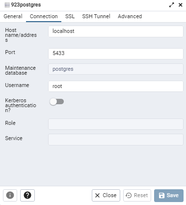

# Setting up the database on your machine

### Container Image 

The database(s) lives in a Docker container. The "image" of the container, that is, the OS running on the virtual machine, is a postgres "alpine" distribution. Alpine is a lightweight Linux distro that is somewhat rare to find on end-user systems, due to its lack of bells and whistles, but is common on containers where size, speed, and security are larger concerns. 

The command `make dependencies` will fetch this image from the Docker hub, assuming you have Docker installed on your computer. It will also install the go dependencies, the sqlc dependency, and the migration dependency.

### Build and start Container

The command `make build_postgres` will use this image and the configuration set up in the `.env` file to actually construct the container from the image and the env settings. 

The command `start postgres` will begin running the container. A port will be exposed based on the settings in the .env file. The Go HTTP Server can communicate with the Database over this port. 

### Create the Actual databases

Now we have a container set up which is running Postgres SQL, and listening, but it doesn't actually have a database created. The .sql files contained in the `migration` folder can be used to instruct postgres on how to build the database. It needs to build both the production database and the test database, but they use the same schema. The commands `make create_db` and `make create_test_db` will create the databases. To populate them with the migrations, use `make migrate_up` and `make migrate_test_up`.

### Access Container cli

If we want to actually access the bash or the postgres shell (psql), there are make commands for that. For example `make psql_testdb` will access psql within the docker container for the test database. We can directly run SQL statements here, such as `select * from "Users";`.

### Get more information about the container

You can use `docker container list` or `docker ps` to list all your running containers. You can use `docker inspect <container>` to get detailed information about a container. This will also show the portmapping that is occurring. For example, if you have grep, which can be installed on windows with chocolatey, you can do `docker inspect <container> | grep IPAddress` to quickly find the IP address. 

If you have `pgAdmin` installed on your computer then you can access the databases with postgres GUI. To do this, you need right click on "Servers" on the left tree and click "Register > Server". Navigate to the "Connection" tab and input the db credentials.

